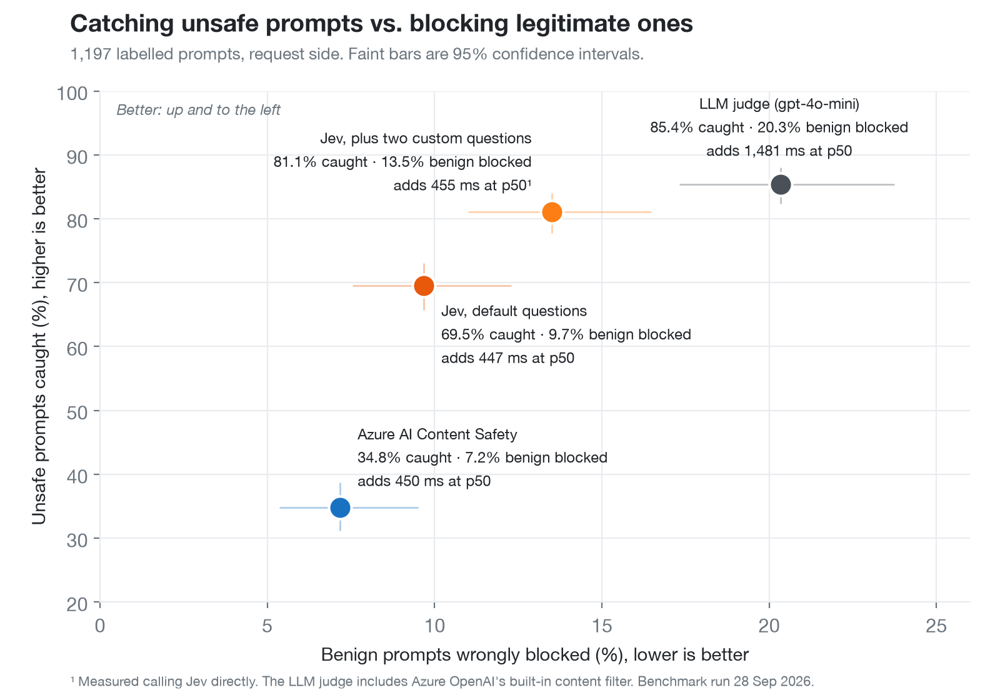
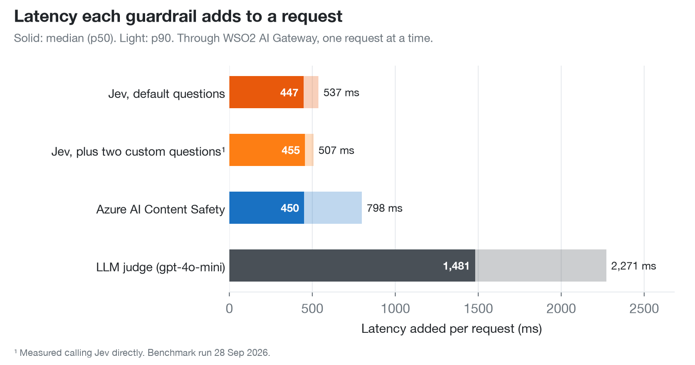

# Jev guardrail benchmark

This benchmark measures how well the **TypeSafe Jev content-safety guardrail** in WSO2 AI Gateway screens prompts, and compares it with two alternatives on the same prompts:

| System | What it is |
|---|---|
| **Jev (defaults)** | The `typesafe-jev-content-safety` policy, request side, with its shipped questions and thresholds |
| **Jev (customised)** | The same defaults plus two extra plain-language questions (hate/harassment, sexual content), to show what operators can add |
| **Azure Content Safety** | WSO2's `azure-content-safety-content-moderation` policy with its shipped thresholds |
| **LLM judge** | `gpt-4o-mini` on Azure OpenAI, asked the same four questions as Jev, with JSON output |

It reports:
- **Accuracy:** unsafe prompts caught and benign prompts wrongly blocked, overall and per category.
- **Threshold trade-offs** for Jev and Azure.
- **Latency:** the time the policy adds in the gateway, the decision call on its own, and latency under load.
- **Cost per 1,000 requests.**
- **Run-to-run stability.**

## Latest results

From [runs/2026-09-28](runs/2026-09-28/REPORT.md) (setup and caveats in [NOTES.md](runs/2026-09-28/NOTES.md)). Figures are request side, through the gateway, with 95% intervals in the report.





| System | Unsafe caught | Benign wrongly blocked | Added latency p50 / p90 | Cost per 1,000 requests |
|---|---|---|---|---|
| Jev (defaults) | 69.5% | 9.7% | 447 / 537 ms | $0.024 |
| Jev (customised: +2 questions) | 81.1% | 13.5% | 455 / 507 ms² | $0.026 |
| Azure Content Safety | 34.8% | 7.2% | 450 / 798 ms | $0.49 |
| LLM judge (gpt-4o-mini)¹ | 85.4% | 20.3% | 1,481 / 2,271 ms | $0.074 |

¹ This includes Azure OpenAI's built-in content filter, which refused 310 of the 1,197 judge calls. On the prompts the model answered itself, it caught 74.3% of unsafe prompts and blocked 12.8% of benign ones.

² Measured calling Jev directly, not through the gateway. For the default questions, direct and in-gateway latency were within 25 ms of each other.

The published run took about 2 hours. It used about **$0.14 of Jev credit**, **$2 of Azure Content Safety** (5,243 text records) and **$0.15 of Azure OpenAI** for the judge, at the prices in `.env.example`. The judge figure counts only the calls the model answered; the 720 calls refused by Azure's content filter recorded no token usage.

## Fairness rules

These were fixed before any results were seen.

- **Same inputs:** every system sees the same 1,197 prompts, in the same order, from the same machine.
- **Shipped defaults:** each system uses its defaults. The customised Jev variant's two questions (in `config/jev_questions.yaml`) were written before the first run, and the headline uses the defaults.
- **Same questions for the judge:** the judge gets exactly Jev's four questions and severity scale, and blocks on the same rule: any "yes", or severity 2 (Serious) or higher.
- **Azure OpenAI's own content filter:** if the filter refuses a judge call, the call is recorded as `filtered` and counted as blocked, because in production the request wouldn't get through. The report also shows the judge on only the prompts it answered itself.
- **Labels are the datasets' own.** Nothing is relabelled. Prompts that every system gets "wrong" are listed in the report's appendix as possible label noise.
- **Isolated latency:** latency is measured through the gateway against an instant mock model. The time added by a policy is taken per prompt, against a route with no guardrail.

## The prompt set

It has 1,197 prompts: 597 unsafe and 600 benign. They are sampled with seed 42 from pinned revisions of public datasets.

| Category | Label | Source (licence) | n |
|---|---|---|---|
| Jailbreak | unsafe | [TrustAIRLab in-the-wild jailbreak prompts](https://huggingface.co/datasets/TrustAIRLab/in-the-wild-jailbreak-prompts) `jailbreak_2023_12_25` (MIT), 200–4,000 chars | 150 |
| Harmful request | unsafe | [JailbreakBench](https://huggingface.co/datasets/JailbreakBench/JBB-Behaviors) harmful (MIT) 100, plus [XSTest](https://huggingface.co/datasets/Paul/XSTest) unsafe contrasts (CC-BY-4.0) 100 | 200 |
| Self-harm | unsafe | [OpenAI moderation evaluation set](https://github.com/openai/moderation-api-release) `SH` (MIT) | 51 |
| Hate / harassment | unsafe | OpenAI moderation `H` / `H2` / `HR` | 100 |
| Sexual | unsafe | OpenAI moderation `S` / `S3` | 60 |
| Violence | unsafe | OpenAI moderation `V` / `V2` | 36 |
| Benign that looks risky | benign | XSTest safe prompts (250), plus JailbreakBench benign (100) | 350 |
| Ordinary real prompts | benign | in-the-wild `regular_2023_12_25` (MIT), 4,000 chars or fewer | 150 |
| Ordinary, unflagged | benign | OpenAI moderation, no label | 100 |

**Multi-label moderation rows** each get one category, in this order: self-harm, then sexual, then hate, then violence.

**The prompt text isn't committed**, because it contains hateful, sexual and self-harm content. `python -m bench.data build` downloads the pinned files, checks their SHA-256 hashes, and rebuilds the set. It then checks the result against [`data/manifest_v1.csv`](data/manifest_v1.csv), which holds the id, source, label and a SHA-256 of every prompt, so you know your set is identical to the one we benchmarked.

**Known label noise:** some in-the-wild "regular" prompts are role-play or jailbreak-style. Some OpenAI "violence" rows describe violence without asking for anything. Read the per-category table with that in mind.

## What you need

- **Python 3.11+.**
- **A WSO2 AI Gateway (1.2.0)** with the `typesafe-jev-content-safety` and `azure-content-safety-content-moderation` policies in its build, and access to its management API.
  - The Jev policy isn't in a release yet. Build it from [wso2/gateway-controllers#309](https://github.com/wso2/gateway-controllers/pull/309) as a local policy.
- **A Jev API key** from TypeSafe AI.
- **An Azure AI Content Safety resource** on the Standard S0 tier (endpoint and key).
- **A `gpt-4o-mini` deployment on Azure OpenAI** for the judge. Call it directly, or through a gateway LLM provider route that has only API key auth.

## Setup

1. **Install:**
   ```bash
   python3 -m venv .venv && . .venv/bin/activate
   pip install -r requirements.txt
   cp .env.example .env         # then fill it in
   python -m bench.data build   # download, rebuild and verify the prompt set
   ```

2. **Gateway `config.toml`**, which the two policies read their keys from:
   ```toml
   jev_apikey = "<Jev key>"
   azurecontentsafety_endpoint = "https://<resource>.cognitiveservices.azure.com"
   azurecontentsafety_key = "<Azure Content Safety key>"
   ```
   Restart the gateway controller and runtime after editing it. To avoid entering the keys twice, set `GATEWAY_CONFIG_TOML` in `.env` to this file.

3. **Mock model, on the gateway's Docker network**, so the gateway can reach it as `bench-mock`:
   ```bash
   docker network ls                     # find the gateway's network, e.g. <prefix>_gateway-network
   docker run -d --name bench-mock --network <gateway-network> \
     -v "$PWD/mock_upstream:/app:ro" python:3.12-slim python /app/mock.py
   ```

4. **Benchmark routes:**
   ```bash
   python -m bench.setup_gw up          # bench-none, bench-jev, bench-azure
   ```
   A route that doesn't become ready usually means a policy failed to start, for example because of a missing key in `config.toml`. The deploy still returns 201 in that case.

## Run

```bash
python -m bench.run P0   # pilot: 63 prompts through every system (a few minutes). Check it before going on.
python -m bench.run P1   # direct scores for Jev (both batteries) and Azure: feeds the threshold sweeps (~3 min)
python -m bench.run P2   # gateway run 1: one call at a time, all systems interleaved per prompt (~1 h)
python -m bench.run P3   # gateway run 2: the same again, for decisions that flip between runs (~1 h)
python -m bench.run P4   # load: 300 prompts, 20 in flight, per system (~2 min)
python -m bench.net      # network connect times from this machine to each hosted service
python -m bench.report   # results/REPORT.md and results/per_prompt.csv
python -m bench.charts runs/<name>   # accuracy and latency charts (PNG + SVG) for a run folder
python -m bench.setup_gw down
```

- **Resumable:** every pass writes `results/<pass>__<system>.jsonl` and picks up where it stopped.
- **Errors:** `--retry-errors` re-runs only the prompts that errored.
- **Budget:** Jev spend is tracked from recorded usage, and a pass stops at `JEV_BUDGET_USD` (default $1).

## How the numbers are computed

- **Unsafe caught** is the share of unsafe prompts blocked. **Benign wrongly blocked** is the share of benign prompts blocked. Both come with 95% Wilson intervals. Errors are counted separately, not as blocks or passes.
- **Headline accuracy** comes from the gateway run (P2) for Jev (defaults), Azure and the judge. The customised Jev variant is only called directly (P1).
- **Latency added by a policy** is the p50/p90/p99 of each prompt's time through the policy's route minus its time through `bench-none`, in the same run.
  - The judge has no WSO2 policy, so its row is the time of the judge call itself: the least a judge policy would add.
  - Hosted-service latency depends on where you run from, so `bench.net` records connect times and the report prints them next to the latency.
- **Cost per 1,000 requests:**
  - Jev: average input tokens × price.
  - Judge: average input and output tokens × prices.
  - Azure: average text records (a record is up to 1,000 characters) × price.

  Prices are set in `.env`. The defaults are the list prices on 28 Sep 2026: Jev $0.042 per million input tokens; gpt-4o-mini Global Standard $0.15 input and $0.60 output per million tokens; Azure Content Safety S0 $0.375 per 1,000 text records (East US).

## Limits

- **Request side only.** Response screening isn't measured.
- **One region, one machine.** Hosted-service latency depends on where you run from. Say where you ran from, and which Azure region, when you share numbers.
- **Fixed thresholds.** Each system is tested at its shipped defaults. The sweeps show how the trade-off moves, but nothing is tuned per system.
- **The judge includes Azure's filter.** The judge row measures `gpt-4o-mini` together with Azure OpenAI's built-in content filter, as a real Azure deployment would behave.

## Layout

```
bench/
  config.py     settings from .env / environment (and optionally the gateway config.toml)
  data.py       build and verify the prompt set from pinned sources
  systems.py    clients: Jev, Azure Content Safety, the LLM judge, and gateway routes
  setup_gw.py   deploy or remove the benchmark routes
  run.py        run the passes, resumable, with the Jev budget cap
  net.py        network connect times
  report.py     metrics, sweeps, latency, cost -> results/REPORT.md
config/jev_questions.yaml   Jev default questions (policy v0.8.0) and the two custom ones
data/manifest_v1.csv        ids, labels and hashes of the 1,197 prompts
mock_upstream/mock.py       instant OpenAI-compatible mock model
```

## Licence

The code is under Apache-2.0. The datasets keep their own licences (listed above) and aren't redistributed here.
